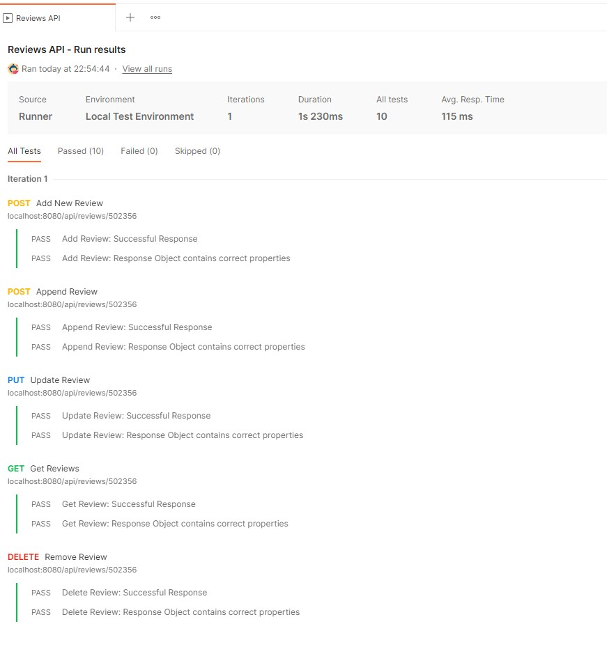
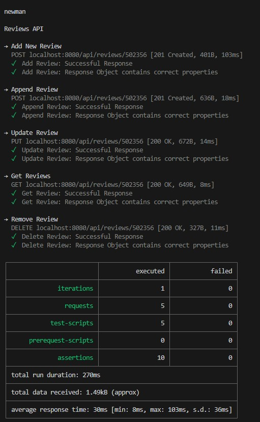

# Assignment 2 - Web API.

Name: Karthikeyan Gopal

## Features.

[A bullet-point list of the ADDITIONAL features/endpoints you have implemented in the API **THAT WERE NOT IN THE LABS** ]. 

 + Feature 1 - Load Generes into MongoDB 

 + Feature 2 - Get Generes to use the list for Movie Filters

 + Feature 3 - Add Movie Reviews - Store movie reviews in Mongo DB

 + Feature 4 - Append Movie Reviews by more users - Store additional movie reviews recorder by more users in Mongo DB

 + Feature 5 - Update Movies Reviews recorded earlier - Retrieve an existing Movie review and update comment

 + Feature 6 - Get Movie Reviews - Retrieve all reviews for a specific Movie

 + Feature 7 - Remove Movie Review - Delete a review recorded by a specific user from the list of reviews


## Installation Requirements

[Describe how to run the API. If you used a DevContainer/Codespace , you can refer to the relevant files in your repo.]

```cmd
git clone https://github.com/gopalkar/moviesAppMongoDb
git clone https://github.com/gopalkar/labMoviesApp -b feature/apiIntegration
```

followed by installation

```bat
npm install --save-dev babel-cli
npm install --save-dev babel-preset-env
npm install --save-dev nodemon
npm install dotenv --save
npm install --save express
npm install --save uniqid
npm install -save axios
npm install -save mongoose
npm install -save joi
npm install --save jsonwebtoken bcryptjs
npm install --save-dev newman
npm install --save-dev newman-reporter-htmlextra
```

## API Configuration

```bat
NODE_ENV=development
PORT=8080
HOST=localhost
DATABASE_DIALECT=mongo
DATABASE_URL=mongodb://localhost:27017/movies_db
JWT_SECRET_KEY=ilikecake
VITE_TMDB_KEY=???

## API Design
[Give an overview of your web API design, perhaps similar to the following: ]

|  |  GET | POST | PUT | DELETE
| -- | -- | -- | -- | -- 
| /api/generes |Loads a list of generes | N/A | N/A |
| /api/generes |Gets a list of generes | N/A | N/A |
| /api/reviews/{movieid} | Add review for a Movie | N/A | N/A | N/A
| /api/reviews/{movieid} | Append review for a Movie | N/A | N/A | N/A
| /api/reviews/{movieid} | Update review for a Movie | N/A | N/A | N/A
| /api/reviews/{movieid} | Get review for a Movie | N/A | N/A | N/A
| /api/reviews/{movieid} | Delete a review for a Movie | N/A | N/A | N/A
| ... | ... | ... | ... | ...

## Security and Authentication
Except Home Page all the other pages are protected. Once you go to Discover App Home page. User login page to register and then login.

## Validation

As part of the review Api, added validations to check if the same autor already added a review in the past. if not add review. Else request user to update.

## Testing




## Integrating with React App

[Describe how you integrated your React app with the API. You can provide a link to the React App repo and give an example of an API call from React App. For example: ]

~~~Javascript
export const getMovies = () => {
  return fetch(
     '/api/movies',{headers: {
       'Authorization': window.localStorage.getItem('token')
    }
  }
  ).then((res) => res.json());
};

~~~

[You can also add images of React app here also if you wish. This can be also shown in the video]

## Extra features

. . Briefly explain any non-standard features, functional or non-functional, developed for the app.  

If you deployed to a hosting service/cloud, you should specify here. 

## Independent learning.

. . State the non-standard aspects of React/Express/Node (or other related technologies) that you researched and applied in this assignment . .  
